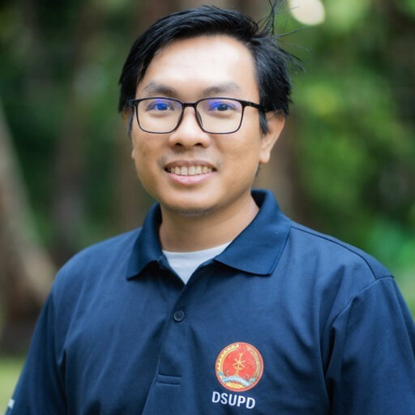
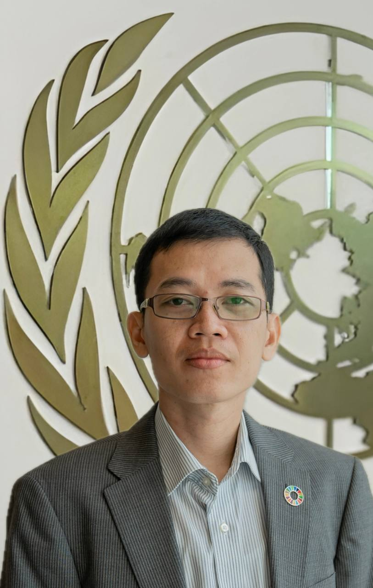
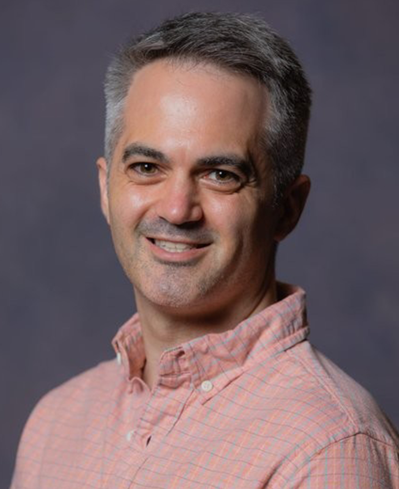
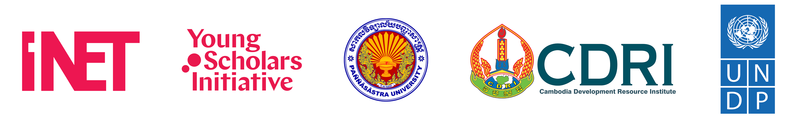

**Date: October 30-31, 2025**  
**Location: Paññāsāstra University of Cambodia, Siem Reap (PUCSR), Siem Reap, Cambodia**

Join us for the premier conference in economics, bringing together leading researchers, practitioners, and industry experts to explore cutting-edge developments and future directions in Southeast Asia.

### Latest Announcements

We would like to inform participants that the announcement of travel stipends and accommodation support has been delayed due to logistical issues on our end. Selected applicants and those not selected for these grants will be notified via email soon. Once the grants are announced, participants will be able to register to attend the conference. We appreciate your patience and understanding.

### Important Dates

- Deadline for abstract submission: **July 15, 2025**.
- Notifications of acceptance will be sent out in **the fourth week of July**.
- Deadline for submission of full papers: **September 30, 2025**.
- Conference dates: **October 30-31, 2025**.

[Submit your abstract here](https://fs8.formsite.com/CNZLjX/puc/index){.btn .btn-primary .mt-3}

Southeast Asia stands at the crossroads of dynamic economic progress and significant socio-economic challenges. As one of the most vibrant and diverse regions globally, it has achieved remarkable strides in economic growth, regional integration, and poverty reduction. However, this growth has been accompanied by rising inequality, environmental degradation, technological disruptions, and increasing vulnerabilities to global uncertainties and climate change. This raises critical questions: How can Southeast Asia balance its rapid economic growth with inequality, ecological change, and digital transformation? Furthermore, how does research on Southeast Asia help us to understand the socio-economic rules that govern the world?
Addressing these polycrises requires innovative, multidimensional solutions that transcend traditional economic paradigms. The 3rd Southeast Asia Economic Research and Development Conference serves as a platform for young scholars, researchers, policymakers, and practitioners to convene, exchange perspectives, and propose actionable solutions tailored to the region’s unique context. 

Adopting an interdisciplinary and pluralist approach, the conference aims to foster dialogue that integrates economic theory, empirical analysis, and practical policy interventions. By leveraging insights from various disciplines and methodologies, participants will contribute to a deeper understanding of the complex interactions shaping Southeast Asia's socio-economic landscape.

The conference seeks to inspire bold and collaborative research that rethinks growth, sustainability, and equity within the region. The papers presented will not only enrich academic discourse but also provide a foundation for evidence-based policymaking to support inclusive and sustainable development in Southeast Asia. We welcome submissions that explore, but are not limited to, the following themes:

## Suggested Contribution Topics
- Economic growth, inequality, and inclusion
- Development and sustenance of social protection and social security system
- Health, and demographic transition
- Urban and regional economics 
- Sustainability, ecology, natural resource management and climate resilience
- Food security and agrarian transformation
- Digital transformation, automation,  and innovation
- Regional integration and trade
- Governance, institutions, and economic policy
- Labour economics and gender
- History of economic thought, economic history and path-dependency
- Interdisciplinary and pluralist approaches in economic analysis

## Confirmed Keynote Speakers

:::: {.grid}

::: {.g-col-12 .g-col-md-3}
{.speaker-img}
**Prof. Sovannroeun Samreth**

*Professor, Saitama University, Japan*
:::

::: {.g-col-12 .g-col-md-3}
{.speaker-img}
**Prof. Phanith Chou** 

*Associate Professor of Environmental Economics, Royal University of Phnom Penh, Cambodia*
:::

::: {.g-col-12 .g-col-md-3}
{.speaker-img}
**Dr. Ratha Chiv** 

*Executive Vice Chancellor, Paññāsāstra University of Cambodia, Siem Reap Campus, Cambodia *
:::

::: {.g-col-12 .g-col-md-3}
{.speaker-img}
**Dr. Daniel Yonto** 

*Assistant Professor, Xi’an Jiaotong-Liverpool University, China *
:::

::: {.g-col-12 .g-col-md-3}
{.speaker-img}
**Prof. Olivier Bargain** 

*Professor of Economics, Bordeaux University, France *
:::

::: {.g-col-12 .g-col-md-3}
{.speaker-img}
**Dr. Maria C. Lo Bue** 

*Assistant professor, University of Trieste, Italy*
:::

::: {.g-col-12 .g-col-md-3}
{.speaker-img}
**Mr. Shakeel Ahmad** 

*Deputy Resident Representative, UNDP Cambodia*
:::

::: {.g-col-12 .g-col-md-3}
{.speaker-img}
**Dr. Rada Khoy** 

*Economist, UNDP Cambodia*
:::

::: {.g-col-12 .g-col-md-3}
{.speaker-img}
**Mr. Theara Khoun** 

*Socio-economic Policy Specialist, UNDP Cambodia*
:::

::::

[More speakers to be updated]()

## Conference Highlights

- **2 Days** of engaging sessions and workshops
- **4+ Keynote** presentations by experts in the field
- **10+ Parallel** sessions covering diverse topics
- **Networking** opportunities with peers and experts
- **Conference Dinner** at a premier venue

## Conference Program

Please download the conference program [here](files/saerd25_program.pdf).

## Registration Information

General participants are welcome to attend SAERD25. You can register to attend the conference [here](https://forms.gle/c12sMvvrr4mT4coL9).

Participation is free of charge, but registration is required to secure your place.

## Travel and Accommodation

We are delighted to welcome you to SAERD25 in Siem Reap, Cambodia. Below you will find practical information to help plan your stay.

### Travel to Siem Reap

- Airport: Siem Reap–Angkor International Airport (SAI) is the main gateway to Siem Reap, with direct flights from Bangkok, Singapore, Kuala Lumpur, Ho Chi Minh City, and other regional hubs.
- From the Airport to the City:
  - Taxi: USD 15–20 (30–40 minutes to the city centre)
  - Hotel pick-up: Many hotels provide transfer services if arranged in advance.

### Transportation in Siem Reap

- Tuk-tuks: The most common way to get around, usually USD 2–5 per trip within the city.
- Ride-hailing apps: PassApp and Grab are widely used for tuk-tuks and cars.
- To the Conference Venue (PUC Siem Reap Campus): About 10–15 minutes by tuk-tuk from most central hotels.

### Accommodation

Siem Reap offers a wide variety of accommodation options for every budget. We encourage participants to book early as October is a busy season for tourists.

### Additional Tips
- Visa: Most nationalities can obtain a tourist visa online ([e-visa](https://www.evisa.gov.kh)) or on arrival. Check requirements before travelling.
- Currency: US dollars are widely accepted; Cambodian riel is used for small transactions.
- Weather in October: Warm (25–32°C) with occasional rain showers—light clothing and an umbrella are recommended.

## Contact

For inquiries about the conference, please contact us at [saerdconf@gmail.com](mailto:saerdconf@gmail.com).

## Supported by
{width=100%}

[Become a Sponsor](contact.qmd)

We welcome collaboration to support young scholars in the region with travel-related expenses. If you are interested in supporting them, please reach out to us using the contact information above.