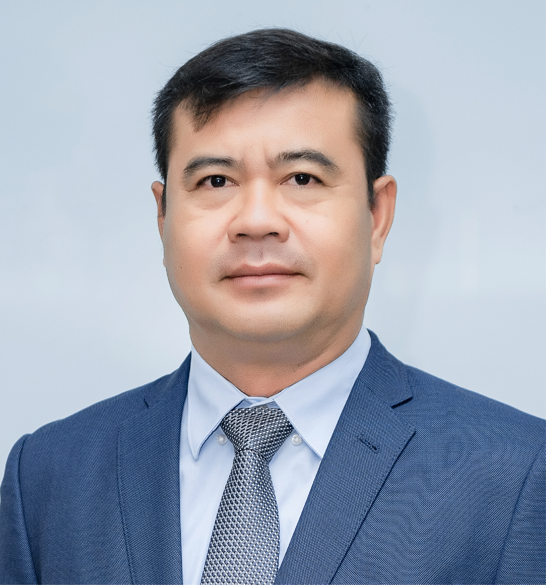
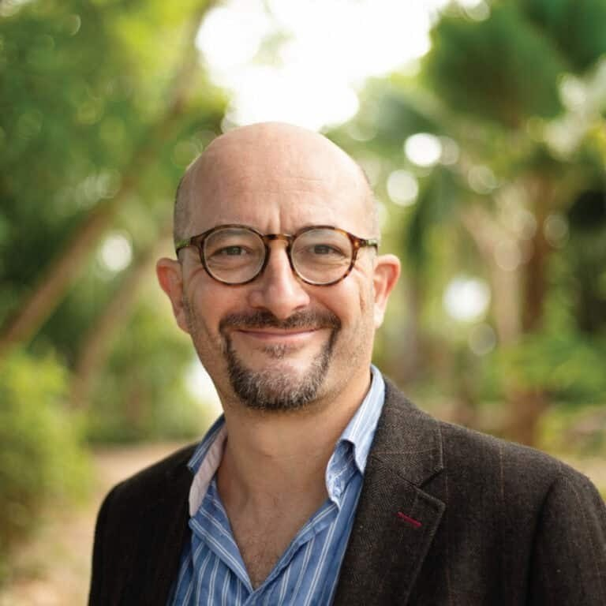
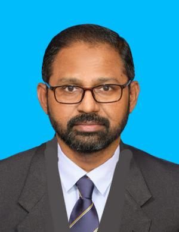
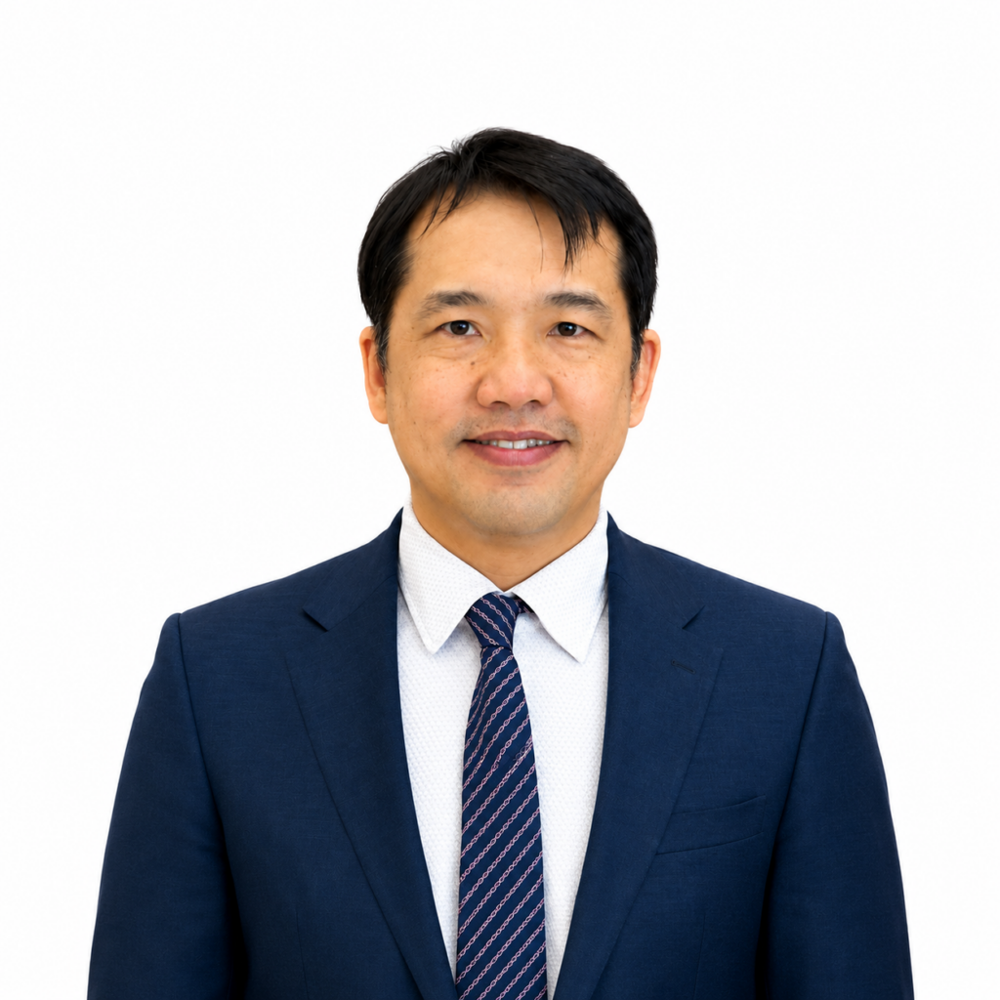
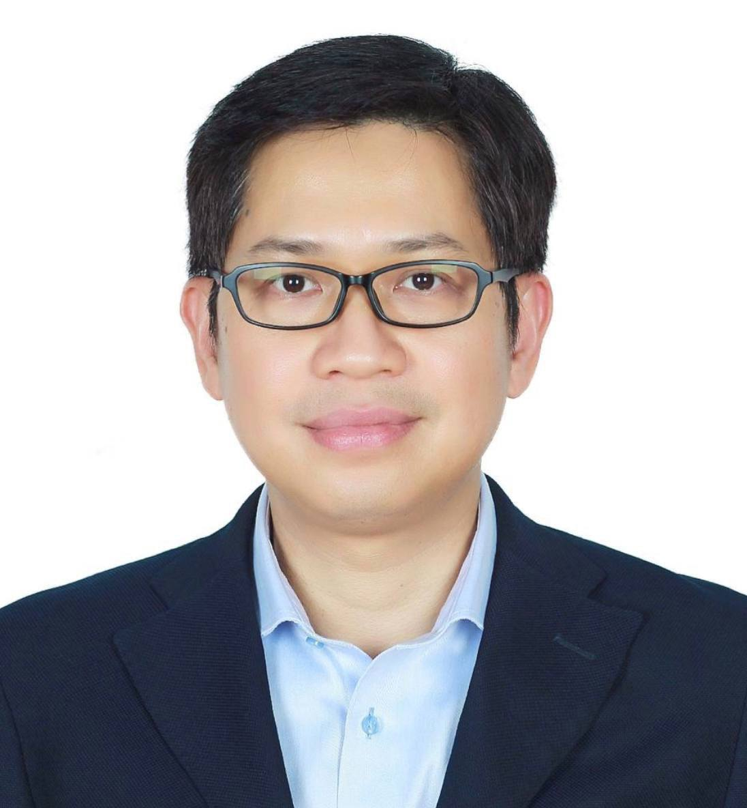
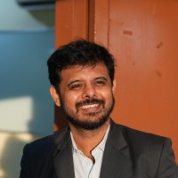

Opening remarks, panel discussants, and plenary speakers at SAERD 2026. Panel A speakers will be announced.

```{=html}
<div class="speaker-grid">
<article class="speaker-card" id="kao-thach"><div class="speaker-photo"></div><div class="speaker-info"><h3>H.E. Dr. Kao Thach</h3><div class="speaker-aff">ARDB, Cambodia</div><div class="speaker-role">Opening and welcome remarks</div><p class="bio-tba">Biography to be announced.</p></div></article>

<article class="speaker-card" id="matthew-mccartney"><div class="speaker-photo"></div><div class="speaker-info"><h3>Prof. Matthew McCartney</h3><div class="speaker-aff">Cambodia Development Resource Institute, Cambodia</div><div class="speaker-role">Panel Discussion B</div><p class="bio-tba">Biography to be announced.</p></div></article>

<article class="speaker-card" id="ratha-chiv"><div class="speaker-photo"><div class="initials" aria-hidden="true">RC</div></div><div class="speaker-info"><h3>Dr. Ratha Chiv</h3><div class="speaker-aff">Executive Vice Chancellor, Paññāsāstra University of Cambodia (PUC), Siem Reap Campus, Cambodia</div><div class="speaker-role">Opening and welcome remarks</div><p class="bio-tba">Biography to be announced.</p></div></article>

<article class="speaker-card" id="micheal-hill"><div class="speaker-photo"><div class="initials" aria-hidden="true">MH</div></div><div class="speaker-info"><h3>Prof. Micheal Hill</h3><div class="speaker-aff">State University of New York, United States</div><div class="speaker-role">Panel Discussion B</div><p class="bio-tba">Biography to be announced.</p></div></article>

<article class="speaker-card" id="thirunaukarasu-subramaniam"><div class="speaker-photo"></div><div class="speaker-info"><h3>Asso. Prof. Thirunaukarasu Subramaniam</h3><div class="speaker-aff">University of Malaya, Malaysia</div><div class="speaker-role">Panel Discussion B</div><p class="bio-tba">Biography to be announced.</p></div></article>

<article class="speaker-card" id="penghuy-ngov"><div class="speaker-photo"></div><div class="speaker-info"><h3>Asso. Prof. Penghuy Ngov</h3><div class="speaker-aff">Royal University of Phnom Penh, Cambodia</div><div class="speaker-role">Panel Discussion B</div><p class="bio-tba">Biography to be announced.</p></div></article>

<article class="speaker-card" id="sovannroeun-samreth"><div class="speaker-photo"></div><div class="speaker-info"><h3>Prof. Sovannroeun Samreth</h3><div class="speaker-aff">Saitama University, Japan</div><div class="speaker-role">Edited Book Project (Day 1); Moderator, Panel Discussion B</div><p class="bio-tba">Biography to be announced.</p></div></article>

<article class="speaker-card" id="sattwick-dey-biswas"><div class="speaker-photo"></div><div class="speaker-info"><h3>Dr. Sattwick Dey Biswas</h3><div class="speaker-aff">YSI/INET</div><div class="speaker-role">Edited Book Project (Day 1)</div><p class="bio-tba">Biography to be announced.</p></div></article>
</div>
```

[View the conference program →](program.qmd)
